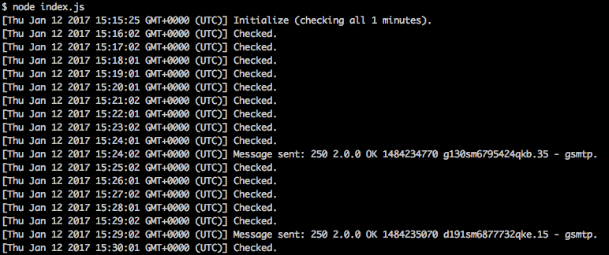

# bot-leboncoin
Bot checking the new offer in terms of setting and send a mail with the info  
Simple bot for the fun

## Installation
npm install  

## Usage

Setting the file setting.json  

research: the text at research  
key_word: words at research in the title of offer  
region: region or all for 'toute la france'  
minus: minimal price  
more: maximal price  
time: checking time  
recipient: recipient mail  
service: email service (ex: gmail)  
user: mail address  
password: password user mail  

$> node index.js  

)
